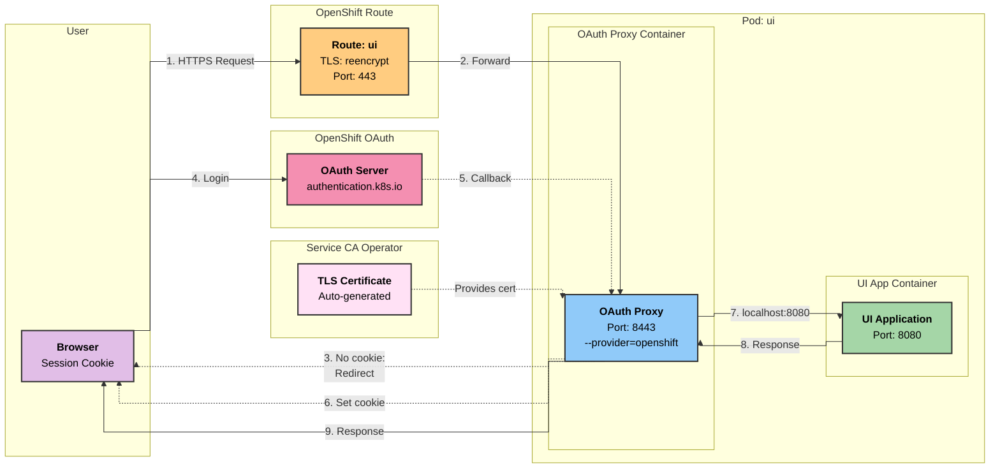
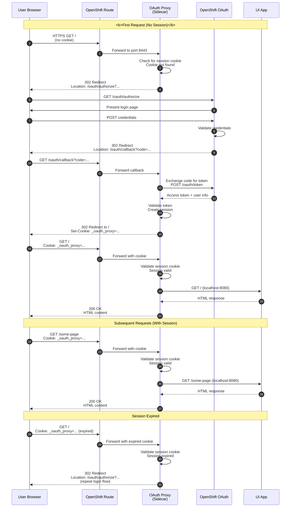

# UI OAuth Authentication for ROS OCP

## Overview

The UI for ROS OCP uses OpenShift's native OAuth proxy as a sidecar container to provide authentication. This allows users to authenticate using their OpenShift credentials without requiring additional identity providers.

### Quick Reference

| Component | Purpose | Location | Port |
|-----------|---------|----------|------|
| **OAuth Proxy** | Authentication proxy with OpenShift OAuth | Sidecar in ui pod | 8443 (HTTPS) |
| **UI App** | Frontend application | Main container in pod | 8080 (HTTP) |
| **OpenShift OAuth Server** | Token validation and user authentication | Cluster control plane | 443 (HTTPS) |
| **OpenShift Route** | External access with TLS reencrypt | Route resource | 443 (HTTPS) |
| **Service CA Operator** | Auto-generates TLS certificates | Cluster-wide operator | N/A |

### Authentication Chain

```
User → OpenShift Route → OAuth Proxy → OpenShift OAuth → Validate
                              ↓                              ↓
                         localhost:8080 ← Session Cookie ← Success
                              ↓
                           UI App
```

## Architecture

### Deployment Architecture



### Authentication Flow Sequence



### Components

- **OAuth Proxy**: Sidecar container (`quay.io/openshift/origin-oauth-proxy`) handling authentication
- **UI App**: Frontend application container serving the web interface
- **OpenShift OAuth Server**: Cluster's built-in OAuth provider for user authentication
- **OpenShift Route**: Exposes the service with TLS reencrypt termination
- **Service CA Operator**: Automatically generates and rotates TLS certificates
- **ServiceAccount**: Configured with OAuth redirect annotation for callback URL

## Configuration

### Helm Values

```yaml
# UI (OpenShift only - OAuth protected frontend)
ui:
  replicaCount: 1
  oauth-proxy:
    image:
      repository: quay.io/openshift/origin-oauth-proxy
      pullPolicy: IfNotPresent
      tag: "latest"
    resources:
      limits:
        cpu: "100m"
        memory: "128Mi"
      requests:
        cpu: "50m"
        memory: "64Mi"
  app:
    image:
      repository: quay.io/cloudservices/ui
      tag: "latest"
      pullPolicy: IfNotPresent
    port: 8080
    resources:
      limits:
        cpu: "100m"
        memory: "128Mi"
      requests:
        cpu: "50m"
        memory: "64Mi"
```

### OAuth Proxy Arguments

The OAuth proxy is configured with the following arguments:

```yaml
args:
- --https-address=:8443                    # Listen on HTTPS port 8443
- --provider=openshift                     # Use OpenShift OAuth
- --openshift-service-account=<name>-ui    # ServiceAccount name for OAuth callbacks
- --cookie-secret-file=/etc/proxy/secrets/session-secret  # Session encryption key
- --tls-cert=/etc/tls/private/tls.crt     # TLS certificate (auto-generated)
- --tls-key=/etc/tls/private/tls.key      # TLS private key (auto-generated)
- --upstream=http://localhost:8080         # Forward to UI app on localhost
- --pass-host-header=false                 # Don't forward original Host header
- --skip-provider-button                   # Skip "Log in with OpenShift" button
- --skip-auth-preflight                    # Skip OAuth consent screen
```

### ServiceAccount Annotation

The ServiceAccount requires a special annotation to enable OAuth redirects:

```yaml
apiVersion: v1
kind: ServiceAccount
metadata:
  name: <fullname>-ui
  annotations:
    serviceaccounts.openshift.io/oauth-redirectreference.primary: |
      {
        "kind": "OAuthRedirectReference",
        "apiVersion": "v1",
        "reference": {
          "kind": "Route",
          "name": "<fullname>-ui"
        }
      }
```

This annotation:
- Tells OpenShift OAuth where to redirect after authentication
- References the Route resource by name
- Enables the OAuth callback URL pattern: `https://<route-host>/oauth/callback`

### TLS Certificate Auto-Generation

The Service CA Operator automatically generates TLS certificates via annotation:

```yaml
apiVersion: v1
kind: Service
metadata:
  name: <fullname>-ui
  annotations:
    service.beta.openshift.io/serving-cert-secret-name: <fullname>-ui-tls
spec:
  ports:
    - port: 8443
      targetPort: https
      name: https
```

The operator:
- Watches for the `serving-cert-secret-name` annotation
- Generates a TLS certificate signed by the cluster CA
- Creates a Secret with `tls.crt` and `tls.key`
- Automatically rotates certificates before expiry

### Session Secret Persistence

The cookie secret is persisted across Helm upgrades using the `lookup` function:

```yaml
{{- $secret := (lookup "v1" "Secret" .Release.Namespace (printf "%s-ui-cookie-secret" (include "ros-ocp.fullname" .))) -}}
apiVersion: v1
kind: Secret
metadata:
  name: {{ include "ros-ocp.fullname" . }}-ui-cookie-secret
type: Opaque
data:
  session-secret: {{ if $secret }}{{ index $secret.data "session-secret" }}{{ else }}{{ randAlphaNum 32 | b64enc }}{{ end }}
```

This ensures:
- ✅ Users remain logged in across Helm upgrades
- ✅ Existing sessions are not invalidated
- ✅ New secret is only generated on initial install or manual deletion

## Testing

### Prerequisites

1. Deployed on OpenShift cluster (UI is OpenShift-only)
2. OpenShift OAuth server is accessible
3. User has valid OpenShift credentials

### Access the UI

```bash
# Get the UI route URL
UI_ROUTE=$(oc get route -n ros-ocp -l app.kubernetes.io/component=ui -o jsonpath='{.items[0].spec.host}')

# Access in browser
echo "https://$UI_ROUTE"

# Or test with curl (will get redirect)
curl -v "https://$UI_ROUTE"

# Expected: 302 redirect to /oauth/authorize
```

### Verify Route Configuration

```bash
# Check route exists
oc get route -n ros-ocp -l app.kubernetes.io/component=ui

# Verify TLS reencrypt termination
oc get route -n ros-ocp -l app.kubernetes.io/component=ui -o jsonpath='{.items[0].spec.tls.termination}'
# Expected: reencrypt

# Check route target
oc describe route -n ros-ocp -l app.kubernetes.io/component=ui
```

### Verify TLS Certificate

```bash
# Check if TLS secret exists
oc get secret -n ros-ocp -l app.kubernetes.io/component=ui | grep tls

# View certificate details
oc get secret <fullname>-ui-tls -n ros-ocp -o jsonpath='{.data.tls\.crt}' | base64 -d | openssl x509 -text -noout

# Verify certificate is valid
oc get secret <fullname>-ui-tls -n ros-ocp -o jsonpath='{.data.tls\.crt}' | base64 -d | openssl x509 -noout -dates
```

### Verify OAuth Proxy Health

```bash
# Check OAuth proxy health endpoint
oc exec -n ros-ocp -l app.kubernetes.io/component=ui -c oauth-proxy -- \
  curl -k https://localhost:8443/oauth/healthz

# Expected: "OK"

# Check OAuth proxy logs
oc logs -n ros-ocp -l app.kubernetes.io/component=ui -c oauth-proxy --tail=50

# Look for:
# - "Listening on :8443"
# - "HTTP: serving on :8443"
```

### Verify UI App Health

```bash
# Check UI app health
oc exec -n ros-ocp -l app.kubernetes.io/component=ui -c app -- \
  curl http://localhost:8080/

# Expected: HTML response

# Check UI app logs
oc logs -n ros-ocp -l app.kubernetes.io/component=ui -c app --tail=50
```

### Test Authentication Flow

```bash
# 1. Open browser in private/incognito mode
# 2. Navigate to https://<ui-route>
# 3. Should redirect to OpenShift login
# 4. Enter OpenShift credentials
# 5. Should redirect back to UI
# 6. UI should load successfully

# Test session persistence
# 7. Refresh page - should not require login
# 8. Close browser and reopen
# 9. Navigate to https://<ui-route>
# 10. Should still be logged in (if session not expired)
```

## Troubleshooting

### OAuth Redirect Loop

**Symptom**: Continuously redirected between UI and OpenShift OAuth

**Diagnosis**:
```bash
# Check ServiceAccount annotation
oc get serviceaccount -n ros-ocp -l app.kubernetes.io/component=ui -o yaml | grep oauth-redirectreference

# Verify route name matches annotation
oc get route -n ros-ocp -l app.kubernetes.io/component=ui -o jsonpath='{.items[0].metadata.name}'
```

**Solution**:
```bash
# Reinstall to fix annotation mismatch
helm upgrade ros-ocp ./ros-ocp -n ros-ocp --force
```

### TLS Certificate Not Generated

**Symptom**: Pod fails to start with "tls.crt: no such file"

**Diagnosis**:
```bash
# Check if Service CA Operator is running
oc get pods -n openshift-service-ca -l app=service-ca

# Check service annotation
oc get service -n ros-ocp -l app.kubernetes.io/component=ui -o yaml | grep serving-cert-secret-name

# Check if secret was created
oc get secret -n ros-ocp | grep ui-tls
```

**Solution**:
```bash
# Wait for certificate generation (usually < 30 seconds)
oc wait --for=condition=ready secret/<fullname>-ui-tls -n ros-ocp --timeout=60s

# If timeout, check Service CA logs
oc logs -n openshift-service-ca -l app=service-ca

# Restart pod to pick up certificate
oc rollout restart deployment -n ros-ocp -l app.kubernetes.io/component=ui
```

### Session Expired Too Quickly

**Symptom**: Users logged out frequently

**Diagnosis**:
```bash
# Check cookie secret age
oc get secret -n ros-ocp <fullname>-ui-cookie-secret -o jsonpath='{.metadata.creationTimestamp}'

# Check if secret changed recently
oc describe secret -n ros-ocp <fullname>-ui-cookie-secret
```

**Solution**:
```bash
# Cookie secret should persist across Helm upgrades
# If manually deleted, users will need to re-login

# Verify lookup function is working
helm get manifest ros-ocp -n ros-ocp | grep -A 5 "lookup.*Secret"
```

### 503 Service Unavailable

**Symptom**: Route returns 503 error

**Diagnosis**:
```bash
# Check pod status
oc get pods -n ros-ocp -l app.kubernetes.io/component=ui

# Check service endpoints
oc get endpoints -n ros-ocp -l app.kubernetes.io/component=ui

# Check route backend
oc describe route -n ros-ocp -l app.kubernetes.io/component=ui
```

**Solution**:
```bash
# Ensure pod is ready
oc wait --for=condition=ready pod -n ros-ocp -l app.kubernetes.io/component=ui --timeout=60s

# Check readiness probe
oc describe pod -n ros-ocp -l app.kubernetes.io/component=ui | grep -A 5 Readiness

# View probe logs
oc logs -n ros-ocp -l app.kubernetes.io/component=ui -c oauth-proxy | grep healthz
```

### OAuth Proxy Crashes

**Symptom**: OAuth proxy container constantly restarting

**Diagnosis**:
```bash
# Check pod events
oc describe pod -n ros-ocp -l app.kubernetes.io/component=ui

# Check oauth-proxy logs
oc logs -n ros-ocp -l app.kubernetes.io/component=ui -c oauth-proxy --previous

# Check resource limits
oc get pod -n ros-ocp -l app.kubernetes.io/component=ui -o jsonpath='{.spec.containers[?(@.name=="oauth-proxy")].resources}'
```

**Solution**:
```bash
# Increase memory if OOMKilled
helm upgrade ros-ocp ./ros-ocp -n ros-ocp \
  --set ui.oauth-proxy.resources.limits.memory=256Mi \
  --set ui.oauth-proxy.resources.requests.memory=128Mi
```

### App Container Not Responding

**Symptom**: OAuth works but app returns errors

**Diagnosis**:
```bash
# Check app logs
oc logs -n ros-ocp -l app.kubernetes.io/component=ui -c app

# Test app directly
oc exec -n ros-ocp -l app.kubernetes.io/component=ui -c app -- \
  curl http://localhost:8080/

# Check app port configuration
oc get deployment -n ros-ocp -l app.kubernetes.io/component=ui -o jsonpath='{.spec.template.spec.containers[?(@.name=="app")].ports[0].containerPort}'
```

**Solution**:
```bash
# Verify app port matches configuration
helm upgrade ros-ocp ./ros-ocp -n ros-ocp --set ui.app.port=8080

# Increase app resources if needed
helm upgrade ros-ocp ./ros-ocp -n ros-ocp \
  --set ui.app.resources.limits.memory=512Mi
```

## Security Considerations

1. **TLS Encryption**
   - Route uses TLS reencrypt termination
   - Traffic is encrypted from user browser to route (TLS)
   - Traffic is re-encrypted from route to OAuth proxy (TLS)
   - Traffic from OAuth proxy to app is unencrypted (localhost only)

2. **Session Management**
   - Sessions stored in encrypted cookies (`_oauth_proxy`)
   - Cookie secret is 32 random alphanumeric characters
   - Secret persists across Helm upgrades to maintain sessions
   - Sessions have TTL and expire after inactivity

3. **Authentication**
   - Uses OpenShift's native OAuth server
   - No external identity provider required
   - User credentials never touch the OAuth proxy
   - OAuth proxy only receives validated tokens from OAuth server

4. **Network Isolation**
   - UI app only accessible via OAuth proxy (no direct external access)
   - OAuth proxy and app communicate over pod-local `localhost`
   - Only OpenShift Route can access OAuth proxy externally

5. **ServiceAccount Permissions**
   - ServiceAccount has no special RBAC permissions
   - OAuth redirect enabled via annotation only
   - No cluster-wide permissions needed

6. **Automatic Certificate Rotation**
   - TLS certificates auto-renewed by Service CA Operator
   - No manual certificate management required
   - Certificates signed by cluster CA

7. **Health Check Bypass**
   - `/oauth/healthz` endpoint does not require authentication
   - Required for Kubernetes liveness/readiness probes
   - Only accessible from within the cluster

## Platform Requirements

**OpenShift Only**: This UI authentication method is exclusively for OpenShift clusters because it depends on:

- ✅ OpenShift OAuth Server (`authentication.k8s.io`)
- ✅ OpenShift Routes with TLS reencrypt
- ✅ Service CA Operator for automatic certificate generation
- ✅ ServiceAccount OAuth redirect annotations

**Automatic Detection**: The UI is only deployed when the chart detects an OpenShift cluster:

```yaml
{{- if eq (include "ros-ocp.isOpenShift" .) "true" }}
# UI resources deployed here
{{- end }}
```

**Kubernetes/KIND**: For non-OpenShift platforms, alternative authentication methods would be required (e.g., OAuth2 Proxy with external provider).

## References

- [OpenShift OAuth Proxy](https://github.com/openshift/oauth-proxy)
- [OpenShift OAuth Server](https://docs.openshift.com/container-platform/latest/authentication/understanding-authentication.html)
- [Service CA Operator](https://docs.openshift.com/container-platform/latest/security/certificates/service-serving-certificate.html)
- [OpenShift Routes](https://docs.openshift.com/container-platform/latest/networking/routes/route-configuration.html)
- [OAuth Redirect Reference](https://docs.openshift.com/container-platform/latest/authentication/using-service-accounts-as-oauth-client.html)

## Related Documentation

- [Configuration Guide](configuration.md) - Complete UI configuration reference with authentication flow diagrams
- [Troubleshooting Guide](troubleshooting.md) - UI-specific troubleshooting procedures
- [Platform Guide](platform-guide.md) - Platform-specific requirements and differences

